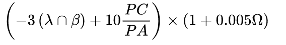

| Versión | Fecha       | Autor      | Descripción                            |
|---------|-------------|------------|----------------------------------------|
| v1.0    | 2024-01-01  | Manuel Ortega| Versión inicial del documento sin firmar, incluye apartados de disponbilidad, dedicación del tiempo y política de avisos                      |
| v2.0     | 2024-02-18 | Manuel Ortega| Se ha añadido un apartado de condiciones del acuerdo y se ha firmado el documento |
|v3.0| 2024-03-21|Manuel Ortega| Se mejora el commitment en cuanto a fórmula de puntuación| 

## 1. Introducción

Al unirme a la asignatura de Ingeniería de Software y Práctica Profesional (ISPP) para el curso 2023-24, me comprometo a cumplir con los siguientes requisitos y condiciones como miembro de MuscleMate.

## 2. Compromisos y condiciones

### 2.1 Dedicación de tiempo

- Me comprometo a dedicar un esfuerzo de 10 horas semanales a las actividades y tareas asignadas.
- Acepto registrar el tiempo dedicado utilizando la herramienta Clockify y proporcionar el detalle necesario para cada tarea.
- Me comprometo a finalizar mis tareas asignadas a tiempo para evitar retrasos en las actividades de otros compañeros.

### 2.2 Horario de disponibilidad

- Reconozco y acepto el horario de disponibilidad establecido para nuestras actividades.
- Se establece un horario de contacto de Lunes a Jueves de 8:00 - 22:00 y Viernes de 8:00 - 15:00, con opción de disponibilidad los fines de semana bajo condiciones específicas.

### 2.3 Compensación de tiempo

- Se establece un sistema de compensación para aquellos miembros que no cumplan con las 10 horas semanales asignadas, con el fin de mantener un equilibrio en la carga de trabajo. Las personas que no cumplan con el tiempo asignado deberán compensar el tiempo en la semana siguiente trabajando el doble de las horas no alcanzadas en esa semana en concreto.

### 2.4 Compromiso y realización de las tareas

- Los conflictos serán abordados primero a nivel de grupo y luego a nivel de proyecto para mantener un ambiente de trabajo armonioso y productivo.
- Las tareas serán asignadas semanalmente con fechas límite establecidas.

### 2.5 Política de avisos

- Se establece una política de avisos para asegurar el cumplimiento de las tareas, con distinción entre avisos leves y graves.
- Se notificará y discutirá cualquier incumplimiento de fechas de entrega.

### 2.6 Criterios de éxito

- Se realizarán revisiones semanales de las tareas, calificando del 0 al 10 y proporcionando una puntuación media de equipo.
- Se establecen niveles de cumplimiento del acuerdo de compromiso.

### 2.7 Fórmula para puntutar los sprint individualmente.

λ = 1 si no ha cumplido las horas
β = 1 si no ha completado todas sus tareas
Ω = minutos de ayuda

### 2.8 Observaciones

- El acuerdo de compromiso puede ser utilizado como referencia para exigir el cumplimiento de las responsabilidades.
- Se compromete a cumplirlo independientemente de la forma de firma utilizada.
- Se compromete a firmar el acuerdo aceptando que este pueda ser modificado en mayoria y no habiendo necesidad de una nueva firma.

### Firmas

- Pedro González Marcos - 10/2/2024
- David Del Hoyo Carboso - 10/2/2024
- David Zarandieta Ortiz - 10/2/2024
- Alejandro Sosa Corral - 10/2/2024
- Elena Tomás Vela - 10/2/2024
- Juan Jesús Martín Hernández - 10/2/2024
- Jorge Romero Limón - 10/2/2024
- David Dana Cabello - 10/2/2024
- Ángel Muñoz Prieto - 10/2/2024
- Juan Carlos Moreno Pérez - 10/2/2024
- Manuel Ortega García - 10/2/2024
- Agustín Devós Bono - 10/2/2024
- Alejandro Mateo Capilla - 10/2/2024
- Luis Garcia Parras - 10/2/2024
- Manuel Vázquez Martín - 10/2/2024
