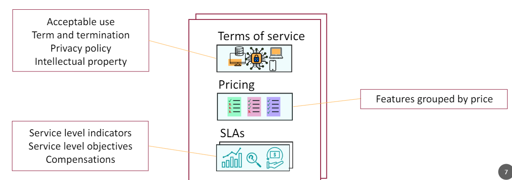

##  Historial de Versiones

| Versión | Fecha       | Autor      | Descripción                            |
|---------|-------------|------------|----------------------------------------|
| v1.0    | 2024-04-04 | Manuel Ortega|Creación del documento|

## Acuerdo del Usuario de MuscleMate

¡Bienvenido a MuscleMate!

Al utilizar MuscleMate ("Servicio"), aceptas quedar sujeto a los siguientes términos y condiciones ("Acuerdo"). Por favor, léelos detenidamente.

1. **Descripción del Servicio:**

MuscleMate es mucho más que una simple aplicación de gestión de gimnasios. Es tu socio digital, diseñado para simplificar y potenciar la administración de tu gimnasio mientras fortaleces la relación con tus clientes. Con MuscleMate, tu gimnasio estará a un nivel superior de eficiencia y comunicación.

**Características Principales:**
- Gestión Integral del Gimnasio
- Comunicación Cliente-Dueño
- Evaluación de Máquinas
- Registro de Entrenamientos
- Oferta de Eventos y Clases
- Funcionalidades Adicionales para Clientes

2. **Términos y Condiciones de Uso:**

Los términos y condiciones de uso de MuscleMate están disponibles para su revisión y aceptación. Puedes acceder a ellos en el siguiente enlace: [Enlace a los Términos y Condiciones de MuscleMate](/docs/Other-Evaluable-Docs/Legal-Impact/customer_agreement) . Al utilizar MuscleMate, aceptas cumplir con los términos y condiciones establecidos en el documento vinculado.

3. **Política de Privacidad:**

La política de privacidad de MuscleMate está disponible para su revisión y consulta. Puedes acceder a ella en el siguiente enlace: [Enlace a la Política de Privacidad de MuscleMate](/docs/Other-Evaluable-Docs/Legal-Impact/privacy_policy). Al utilizar MuscleMate, aceptas estar sujeto a los términos y condiciones establecidos en la política de privacidad vinculada.

4. **Proceso de Registro:**

Para utilizar MuscleMate, es necesario que te registres a través de un trabajador del gimnasio afiliado que trabaje con nosotros. Durante el proceso de registro, deberás proporcionar la siguiente información al trabajador del gimnasio: nombre, fecha de nacimiento, dirección, correo electrónico, teléfono y población. Una vez que el trabajador del gimnasio haya recopilado esta información, te proporcionará una contraseña inicial para acceder a tu cuenta en MuscleMate. Después del registro, tendrás la opción de cambiar esta contraseña para garantizar la privacidad y seguridad de tu cuenta.

5. **Uso del Servicio:**

Al utilizar MuscleMate, aceptas utilizar el servicio únicamente para fines legítimos y de acuerdo con este acuerdo. Eres responsable de mantener la confidencialidad de tu cuenta y contraseña, y de restringir el acceso a tu dispositivo y cuenta. Además, aceptas ser el único responsable de todas las actividades que ocurran bajo tu cuenta.

6. **Propiedad Intelectual:**

Todo el contenido y los materiales proporcionados en MuscleMate son propiedad intelectual de la empresa desarrolladora de la aplicación y están protegidos por las leyes de derechos de autor y otras leyes de propiedad intelectual. No se permite la reproducción, distribución o modificación del contenido sin autorización previa por escrito.

7. **Terminación:**

Cualquiera de las partes puede dar por terminado este acuerdo mediante notificación por escrito a la otra parte con al menos un mes de antelación. Nos reservamos el derecho de terminar o suspender tu acceso a MuscleMate por incumplimiento de este acuerdo u otras razones justificables, previa notificación con un mes de antelación siempre que sea posible.

8. **Limitación de Responsabilidad:**

Ni MuscleMate ni sus afiliados serán responsables por ningún daño directo, indirecto, incidental, especial, consecuente o punitivo que surja de tu mal uso de la aplicación. Si se hace responsable de los daños causados después de un uso adecuado.

9. **Cambios en el Acuerdo:**

Nos reservamos el derecho de modificar este acuerdo en cualquier momento. Te notificaremos sobre cualquier cambio significativo mediante un aviso visible en la aplicación o por otros medios de comunicación. Se te pedirá que aceptes nuevamente el acuerdo. Si no aceptas los cambios, no podrás continuar utilizando la aplicación.

10. **Ley Aplicable:**

Este acuerdo se regirá e interpretará de acuerdo con las leyes del lugar donde esté establecida la empresa desarrolladora de MuscleMate, sin tener en cuenta sus disposiciones sobre conflictos de leyes.

11. **Contacto:**

Si tienes alguna pregunta sobre este acuerdo o sobre el uso de MuscleMate, no dudes en contactarnos. Puedes encontrarnos en nuestro apartado de contactos dentro de la aplicación o enviarnos un correo electrónico a través de [Dirección de correo electrónico de contacto].

---

--------------------------------------------------------------------------------------------------------------------------

# Definición de nuestras SLA
[Link a nuestro apartado SLA](/docs/Other-Evaluable-Docs/SLA)

## MuscleMate User Agreement

Welcome to MuscleMate!

By using MuscleMate ("Service"), you agree to be bound by the following terms and conditions ("Agreement"). Please read them carefully.

1. **Description of Service:**

MuscleMate is much more than just a gym management application. It is your digital partner, designed to simplify and enhance the administration of your gym while strengthening your relationship with your customers. With MuscleMate, your gym will be at a higher level of efficiency and communication.

**Key Features:**
- Comprehensive Gym Management
- Customer-Owner Communication
- Machine Evaluation
- Training Log
- Events and Classes Offering
- Additional Features for Customers

2. **Terms and Conditions of Use:**

The terms and conditions of use of MuscleMate are available for review and acceptance. You can access them at the following link: [Link to MuscleMate Terms and Conditions](/docs/Other-Evaluable-Docs/Legal-Impact/customer_agreement). By using MuscleMate, you agree to comply with the terms and conditions set forth in the linked document.

3. **Privacy Policy:**

The privacy policy of MuscleMate is available for review and consultation. You can access it at the following link: [Link to MuscleMate Privacy Policy](/docs/Other-Evaluable-Docs/Legal-Impact/privacy_policy). By using MuscleMate, you agree to be subject to the terms and conditions set forth in the linked privacy policy.

4. **Registration Process:**

To use MuscleMate, you need to register through an affiliated gym worker who works with us. During the registration process, you will need to provide the following information to the gym worker: name, date of birth, address, email, phone, and city. Once the gym worker has collected this information, they will provide you with an initial password to access your MuscleMate account. After registration, you will have the option to change this password to ensure the privacy and security of your account.

5. **Use of the Service:**

By using MuscleMate, you agree to use the service only for legitimate purposes and in accordance with this agreement. You are responsible for maintaining the confidentiality of your account and password, and for restricting access to your device and account. Additionally, you agree to be solely responsible for all activities that occur under your account.

6. **Intellectual Property:**

All content and materials provided in MuscleMate are the intellectual property of the application's developing company and are protected by copyright laws and other intellectual property laws. Reproduction, distribution, or modification of the content is not allowed without prior written authorization.

7. **Termination:**

Either party may terminate this agreement by providing written notice to the other party with at least one month's notice. We reserve the right to terminate or suspend your access to MuscleMate for breach of this agreement or other justifiable reasons, with one month's notice whenever possible.

8. **Limitation of Liability:**

Neither MuscleMate nor its affiliates will be liable for any direct, indirect, incidental, special, consequential or punitive damages arising from your misuse of the application. if you are responsible for damage caused after good use.

9. **Changes to the Agreement:**

We reserve the right to modify this agreement at any time with prior notice. We will notify you of any significant changes by means of a visible notice in the application or by other means of communication. After this, you will be asked to sign the agreement again.

10. **Applicable Law:**

This agreement shall be governed and construed in accordance with the laws of the jurisdiction where the MuscleMate developing company is established, without regard to its conflict of law provisions.

11. **Contact:**

If you have any questions about this agreement or the use of MuscleMate, feel free to contact us. You can find us in our contact section within the application or send us an email at [Contact Email Address].

---
