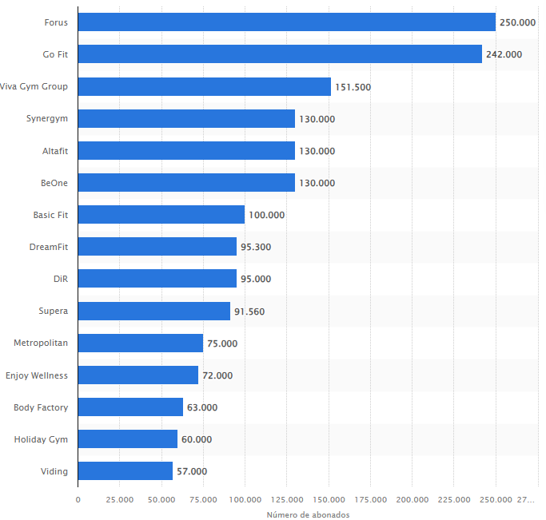
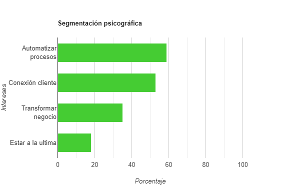

### Musclemate, Grupo 3, PPL

| Versión | Fecha      | Autor                 | Descripción            |
| ------- | ---------- | --------------------- | ---------------------- |
| v1.0    | 2024-05-03 | Pedro González Marcos | Creación del documento |

## Tipo de mercado

Como ofrecemos software de gestión de gimnasios vamos a vender nuestra aplicación

a **empresas de fitness (B2B)**.

## Tipos de gimnasio

Podemos distinguir en el mercado diferentes tipos de establecimientos que necesitan
software de gestión:

### Gimnasios tradicionales

Ofrecen a sus usuarios la posibilidad de hacer ejercicios en máquinas, apuntarse a clases,
preguntar a monitores. No suelen destacar por una atención a los usuarios muy personalizada.
Los abonos que ofrece el gimnasio suele ser económicos y no supone una barrera de entrada
para el consumidor.

Suelen tener altas y bajas constantes de sus socios.

Aquí podemos encontrar:

- Gimnasios que no utilizan soluciones informáticas
- Gimnasios utilizan otras apps para gestionar su negocio
- Gimnasios que utilizan sólo software de gestión de facturación
- Gimnasios que utilizan software de gestión de una consultora: Por ejemplo el gimnasio, New Fitness que es un gimnasio sevillano en
  Castilleja de la cuesta que tiene una [app](https://play.google.com/store/apps/details?id=com.sportconsulting.newfitness&hl=es&gl=ES) personalizada
  que ofrece a sus abonados. Hecho por la consultora [Sport Consulting](https://www.sport-consulting.net/software/).

### Gimnasios franquiciados

Mismos servicios que los gimnasios tradicionales
Los abonos que ofrece el gimnasio suele ser económicos y no supone una barrera de entrada
para el consumidor. Suelen tener altas y bajas constantes de sus socios.
Utilizan software de gestión que ofrecen a los abonados. Su aplicación
suele ser bastante genérica y no destaca por su usabilidad.

Aquí podemos encontrar:

- Gimnasios que utilizan software de gestión de la propia franquicia ([Basic-Fit](https://www.basic-fit.com/es-es/basic-fit-app), [Mcfit](https://www.mcfit.com/es/app))

### Gimnasios Prémium o de boutique

Son negocios que aparte de ofrecer las características de un gimnasio ofrecen más servicios
que aumenta la reputación y la calidad del servicio. Pueden tener cafetería, saunas, spa, piscina.
También cuentan con profesionales especializados en nutrición, fisioterapia, personal training, masajes.
Se caracterizan por un servicio muy personalizado al cliente. Suelen tener poco socios
para poder atender a cada cliente individualmente.

Los abonos suelen ser bastante más caros que los gimnasios tradicionales. Inviertes más
dinero en un servicio de calidad.

Aquí podemos encontrar:

- Gimnasios que no utilizan soluciones informáticas: Podemos encontrar a [saludando](https://business.virtuagym.com/es/cliente/saludando/)
  que utilizaba un sistema manual para el seguimiento de clases.
- Gimnasios que utilizan software de gestión de finanzas: Por ejemplo podemos encontrar, [Akros](https://business.virtuagym.com/es/cliente/akros/)
  training un centro de entrenamiento de grupos reducidos que utilizaban solo software de facturación.

### Otros negocios de fitness

Aquí incluimos otras instalaciones deportivas más especializadas que igualmente
necesitan software de gestión como centros de yoga, instalaciones de CrossFit,
instalaciones de CrossFit, etc...

## Segmentación firmográfica

Si tuviéramos que hacer una segmentación de mercado firmográfico según el tamaño
del mercado de mayor a menor tendríamos:

1. Los gimnasios tradicionales y los gimnasios de franquicia
2. Los gimnasios prémium o boutique
3. Otros negocios de fitness

En esta imagen podemos ver un ranking de franquicias de gimnasios según el número de abonados

## Segmentación geográfica

Vamos a empezar con los gimnasios de la provincia de Sevilla. Si llegamos a tener una buena
tracción en el mercado consideraremos una expansión nacional en otras provincias.

## Segmentación psicográfica

Viendo los testimonios de los casos de éxito de VirtuaGym se ha hecho un análisis de los intereses
de cada gimnasio.

Los gimnasios de los casos de éxito que aparecen en la plataforma son los siguientes:

- Salud y Movimiento (Gym Boutique)
- KHINN Center (Gym Boutique)
- Pacific Beach Training (Gym boutique)
- PaaldansStudio Dance Center (Otros negocios de fitness)
- Holmes Place (Gym Boutique)
- Numen Yoga Studio (Otros negocios de fitness)
- Madrid Warriors (Gym Boutique)
- iMoveGyn (Gym Boutique)
- Artes Timefit (Gym Boutique)
- Detailors (Gym Boutique)
- Rosales training (Gym Boutique)
- YOGAM (Otros negocios de fitness)
- Arkos training (Gym Boutique)
- saludando (Gym Boutique)
- Akasha (Gym Boutique)
- LIJFSTIJL Coaches (Gym Boutique)
- Peninsula Metropolitan (Gym Boutique)

Podemos encontrar en los casos de éxito testimonios como:

Llegado el punto en el que estaba yo, llega un momento en donde te saturas y
necesitas tener un apoyo informático donde poder delegar y automatizar funciones.
Eso te hace ganar tiempo y calidad en el servicio: el cliente lo ve mucho más
serio ya que todo sale de manera rodada." (Salud y Movimiento)

"Para nosotros es fundamental abocarse a la situación real de cada cliente,
diseñando un plan de trabajo adaptado a cada situación personal." (Madrid Warriors)

Los requisitos de Rosales Training estaban marcados, crear un centro que estuviese
lo más actualizado posible. "No queríamos que fuese algo impersonal como muchos centros
low-cost que llevan sus aplicaciones. Por ello, un software era necesario sí o sí. (Rosales training)

"Necesitábamos una solución que proporcionara una extensión digital de la comunidad de Y
donde los asistentes, entrenadores, personal y voluntarios pudieran participar en un entorno digital".
Leyendo cada uno de los testimonios hemos podido identificar 4 intereses comunes que segmentan
el mercado:

- Automatización de procesos y ahorrar tiempo en gestión
- Ofrecer a los clientes un servicio único de seguimiento personalizado
- Transfomar el negocio y expandirse a un mercado digital
- Estar a la última de las tecnologías de gestión para competir con otros negocios

Podemos clasificar estos negocios según estos intereses identificados:

**Automatizar procesos** (Estos negocios quieren una solución informática
para automatizar los procesos más manuales de negocio. Necesitan funcionalidades
para gestionar las clases, las altas y las bajas de los usuarios, la facturación
de su negocio)

- Salud y movimiento
- KHINN Center
- PaaldansStudio Dance Center
- Madrid Warriors
- Artes Timefit
- Detailors
- Rosales training
- Arkos training
- saludando
- LIJFSTIJL Coaches

**Conexión con el cliente** (Aquí encontramos negocios que tener un canal
de comunicación directa con el cliente. Necesitan un chat,
gestión de rutinas de los clientes, gráficas para ver su progreso, etc...)

- Salud y movimiento
- Madrid Warriors
- iMoveGym
- Artes Timefit
- Detailors
- YOGAM
- Arkos training
- LIJFSTIJL Coaches
- Peninsula Metropolitan

**Transformar negocio** (Dentro de esta categoría podemos encontrarnos negocios
que quieran expandirse al mercado digital, complementar su negocio con una
aplicación, cambiar de aplicación de gestión de gimnasios)

- Pacific Beach training
- Holmes Place
- Numen Yoga Studio
- saludando
- Akasha
- Peninsula Metropolitan

**Estar a la última en tecnologías** (Estos negocios quieren competir con los
gimnasios más grandes y para ello necesitan la tecnología. También las aplicaciones
le sirven para distinguirse de otros gimnasios con aplicaciones más mediocres)

- Pacific Beach training
- Rosales training
- Akasha

Analizando los datos extraídos de los casos de éxito tenemos:

10 de 17 gimnasios quieren automatizar procesos un 58,82 %

9 de 17 gimnasios quieren conectar con el cliente un 52,94 %

6 de 17 gimnasios quieren transformar su negocio un 35,29 %

3 de 17 gimnasios quieren estar a la última en tecnologías un 17,64%

De estos datos podemos concluir que los gimnasios tradicionales y los más prémium
todavía no utilizan software de gestión para llevar su negocio. Siendo un segmento
de mercado bastante potente en el que incidiremos al principio.

También de los datos podemos identificar que el mercado de gimnasios boutique dado el
servicio personalizado al cliente que ofrecen, están obligados a optar por soluciones
informáticas si quieren dar un buen servicio. No obstante sería complicado atraer clientes
de este sector. Por ejemplo VirtuaGym tiene bastantes funcionalidades y unos clientes muy
contentos con la aplicación, por lo que MuscleMate necesitaría poco a poco
añadir más características y ofrecer servicios únicos para que consideren otra alternativa.

Otro mercado potencial para comenzar a vender nuestra aplicación sería los negocios
especializados en otras disciplinas como el yoga, la escalada, el baile, las artes marciales
que también necesitan este tipo de soluciones informáticas.

Por último un segmento en el que podríamos incidir serían los negocios que utilizan múltiples
aplicaciones para llevar su negocio y carecen de una aplicación para todo.
