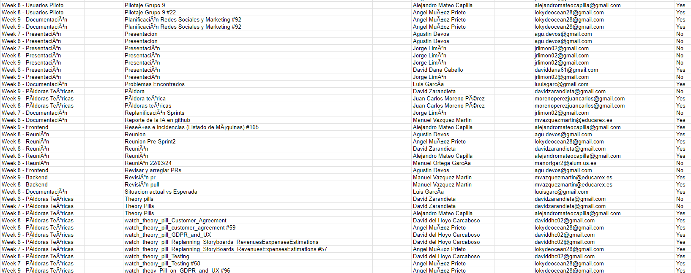
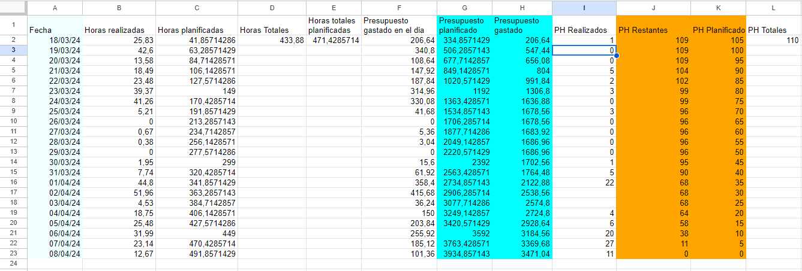
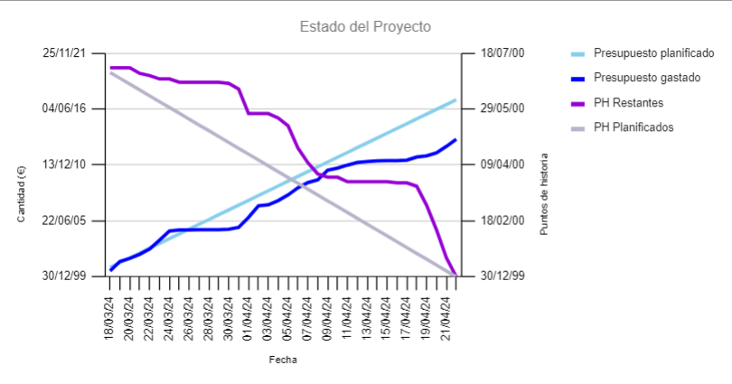

---
title: Expected vs Actual Situation
---

## Musclemate, Grupo 3, Sprint 3

## Historial de Versiones
| Versión | Fecha      | Autor          | Descripción                  |
| ------- | ---------- | -------------- | ---------------------------- |
| v1.0    | 2024-03-20 | Luis García Parras | Creación del documento       |
| v2.0    | 2024-03-31 | Luis García y Elena Tomás  | Actualización del documento |
| v3.0    | 2024-04-4 | Luis García y Elena Tomás  | Actualización del documento |
| v4.0    | 2024-04-22 | Luis García  | Actualización del documento completa y nuevo formato |

# I. Introducción

En este documento vamos a enseñar cuál es el estado de nuestro proyecto a lo largo del tiempo, es decir, se va actualizando cada semana. Se muestra mediante una gráfica que relaciona los puntos de historia con el presupuesto planificado.

## ¿Cómo lo hemos desarrollado?:

- Primeramente, en la hoja de excel sacamos cada semana el informe de clockify mediante el tag de la semana (Week X) de todos los integrantes.

- En segundo lugar, tenemos una calculadora de Estado del Proyecto, que según las horas realizadas cada día, el presupuesto planificado y los puntos de historia planificados y finalizados por fecha nos da lugar a una gráfica en tiempo real de nuestro proyecto.

# II. Estado del Proyecto

El proyecto a día 22 de abril de 2024 tras 10 semanas de desarrollo se encuentra en este estado:

